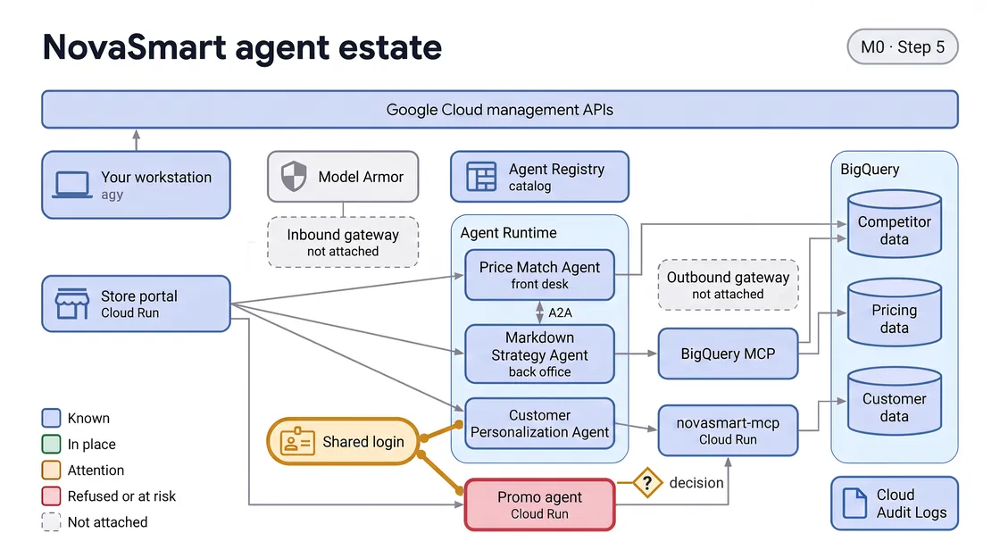

# M0 · See Everything — Instructions

In this module you find out what NovaSmart says it runs, what is really running, and who has been reading customer data. Every step is read-only: you change nothing and fix nothing. Fixing is M1.

> **Before you start**
> - Use a new agy conversation for each module, starting with this one. One long conversation carries every earlier module's history, which slows agy down and makes its answers less reliable.
> - If replies are slow, ask agy to skip the pictures; every step works the same without them.

<!-- FIGURE:I01 BEGIN -->


<!-- FIGURE:I01 END -->

## Step 1 · Check your environment

**Goal:** Make sure your workstation and cloud project are ready before you look at anything.

First, check the model picker in the chat box reads Gemini 3.8 Flash Low. If it does not, open it and pick Gemini 3.8 Flash, then Low.

Ask agy:

```
Check my environment is ready.
```

**What to expect:**

- agy checks its own toolkit and your cloud project, then opens by saying plainly whether you are ready to start.
- A short table follows: one row per check, how agy verified it, the result, and anything it safely fixed.
- If anything comes back not ready, ask agy to fix it before you move on.
- Nothing in your environment changes; any safe fix agy makes is named in the table.

## Step 2 · Meet your estate

<!-- FIGURE:K0S2 BEGIN -->


<!-- FIGURE:K0S2 END -->

**Goal:** See the official record: the catalog of agents NovaSmart says it has.

Ask agy:

```
What AI agents do we officially have?
```

**What to expect:**

- Six distinct agents across the catalog's two locations. agy counts each location (four and three), because Workspace Agent is listed in both.
- Three are NovaSmart's: Price Match Agent, then markdown-strategy-agent and customer-personalization-agent in lowercase, the names those two give themselves.
- Three are Google's own built-in agents, listed automatically: Workspace Agent, Gemini Enterprise Core Assistant and Deep Research. None is a NovaSmart workload.
- Nothing looks wrong. Nothing in your environment changes.

More background: Reference Guide tab, Meet your estate

## Step 3 · Widen the net

<!-- FIGURE:K0S3 BEGIN -->


<!-- FIGURE:K0S3 END -->

**Goal:** A catalog only lists what someone remembered to register. Find out what is actually running.

Ask agy:

```
Now show me everything that's actually running. Is anything running that isn't on that list?
```

**What to expect:**

- Everything running on Agent Runtime (Google Cloud's managed service for running agents) and Cloud Run, matched against the catalog.
- Exactly one workload the catalog has never heard of: the marketing team's promo agent, `promo-agent-shadow`, with no owner and no record.
- Google's three built-in agents show as in the catalog with nothing of yours running; that is expected. The store's own services and `remote-browser-vm1`, this lab's workstation, are infrastructure, left out of the comparison.
- Nothing in your environment changes.

More background: Reference Guide tab, Widen the net

## Step 4 · Who's reading customer data

<!-- FIGURE:K0S4 BEGIN -->


<!-- FIGURE:K0S4 END -->

**Goal:** Your customer database holds 20 customer records. Find out who has been reading it.

Ask agy:

```
Who's been reading our customer database?
```

**What to expect:**

- A Cloud Audit Logs record of customer-table reads: logins, not agents. The lab's setup account is housekeeping; the default compute account (the store portal) may appear.
- What matters: a read under the login the promo agent and the Customer Personalization Agent share, and which service used it, Cloud Run or Agent Runtime.
- Each runtime hosts one of the two, so you can infer the agent from where it runs, not who it is. That breaks once another workload shares the login.
- Price Match and Markdown Strategy do not appear. Nothing in your environment changes.

More background: Reference Guide tab, Who's reading customer data

## Step 5 · Decide

<!-- FIGURE:K0S5 BEGIN -->



<!-- FIGURE:K0S5 END -->

**Goal:** Make the leadership call yourself before you go on. There is no prompt for this step.

- Own it or kill it? Do you shut the promo agent down, or bring it under a named owner — and why?
- Does a marketing agent need the whole customer database, or any of it?
- What is the blast radius if you over-grant access now, just to be safe, and the agent is later tricked or breached?

More background: Reference Guide tab, Decide

## Step 6 · What's next

<!-- FIGURE:K0S6 BEGIN -->


<!-- FIGURE:K0S6 END -->

*Optional.* You can go straight to M1, or open the **What did we learn?** tab.

> **Going to M1?** Start a new agy conversation first, then ask M1's first prompt there.

- You now know what is officially registered, what is really running, and who reads customer data under a shared login. None of it is fixed.
- M1 · Take Action is where you fix it — register the shadow agent, give each agent its own identity, and scope its access down to what its job actually needs.
- In M1 you also find out whether your answer to the first question above matches the leadership call.

## Try this too — optional

*Optional.* Ask any of these, in any order, or skip them.

Ask agy:

```
Could something be running somewhere we didn't look?
```

This shows you which places were searched and which were not, so you can judge what a clean comparison is worth.

Ask agy:

```
Would anything have told us about that agent if we hadn't gone looking?
```

This shows you whether anything would have flagged that agent on its own, or whether finding it depended on someone looking.

Ask agy:

```
If a regulator asked who read a particular customer's record, what could we actually give them?
```

This shows you which half of that question your audit trail can answer and which half it cannot.

## Step 7 · Show what you found

*Optional.* You can skip this and go to M1, or open the **What did we learn?** tab.

Pick any of these, in any order. Each takes agy a few minutes.

```
Build me an executive dashboard of the agent estate I found in this module.
```

An executive dashboard of your estate. A good place to start.

```
Build me an investigation board that answers: who touched our customer data?
```

An investigation board on the shared login: what the log proves about who read customer data, and what it cannot.

```
Build me a game called Shadow Hunt from what I found, for my team to play.
```

A three-round game for your team to spot the gaps you found.

```
Turn what I found into a two-minute briefing I can present to the board.
```

A short slide briefing for your board.

```
Make a one-page poster of what I found that I can share.
```

A one-page poster to share.

Each page is saved in the novasmart-showcase folder on your Desktop. agy gives you each page's file name but cannot open a browser window in this lab: in Chrome, go to `file:///config/Desktop/novasmart-showcase/` and click the page. Pages use only what agy recorded in Steps 1 to 4. Nothing in your environment changes.

> **Going to M1?** Start a new agy conversation first, then ask M1's first prompt there.
