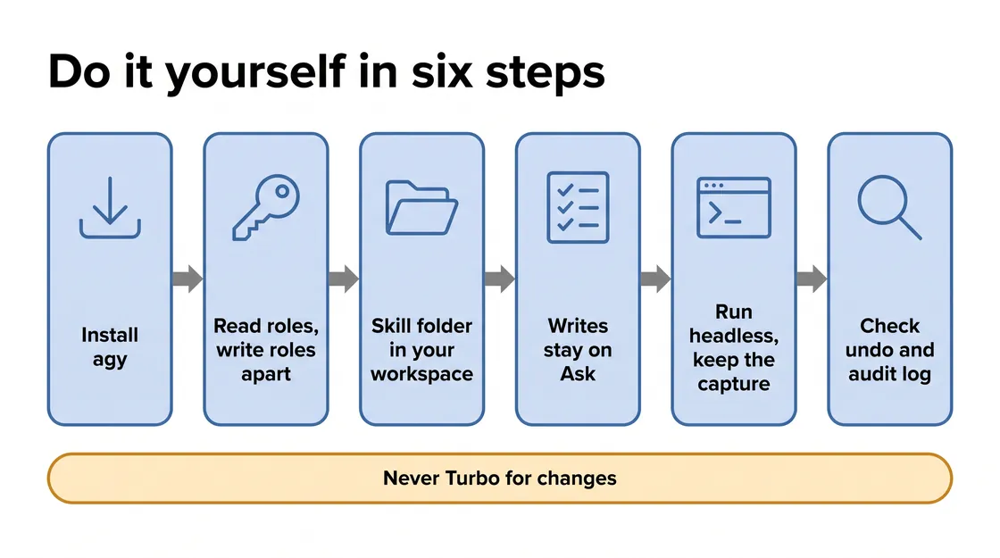

# M1 · Take Action — Skill Mapping

*Read this after you finish Module 1. It explains what each prompt was for, so it gives away the module's findings.*

Every number here comes from one test run on October 3, 2026 (agy 1.1.19, Gemini 3.8 Flash with low thinking): 13 prompts, 128 tool calls, about 39 minutes. The run registered the promo agent, moved the Customer Personalization Agent onto its own Agent Identity, created `promo-agent-sa` for the promo agent and pointed it there, made three grants and removed one role. Your run will differ.

## What you learned

<!-- FIGURE:S1_01 BEGIN -->


<!-- FIGURE:S1_01 END -->

The prompts are a leader's questions. The technique is what the skill turned them into. Module 1 changes the project, so one thing differs from Module 0: for every change, agy says what it will do, does it, re-reads the live resource, and writes a change record with the exact undo command. A change counts only once the re-read shows it.

The skill adds `references/m1.md`, read whole at the first prompt, plus `m1-step3.md`, `m1-step5.md`, `showcase.md` and `showcase-m1.md`, each read only at its step. Each stays under about 44 KB so agy reads it in one call.

## Does the skill know the answers? Yes.

<!-- FIGURE:S1_02 BEGIN -->

![When each change may happen: five columns. Step 1, Register: Agent Registry; owner on record, one entry added (green card). Step 2, Inspect: IAM and BigQuery; reports the power, changes nothing (gray card). Step 3, Separate: Agent Runtime and Cloud Run; seven changes, fixed order (green card). Step 4, Cut off: BigQuery access list; removes only what remains (gray card). Step 5, Prove: Cloud Audit Logs; proves it, changes nothing (gray card). Each card has an open padlock. A band below reads: Says only what its own re-read showed.](images/S1_02_when_each_change_may_happen.webp)

<!-- FIGURE:S1_02 END -->

`references/m1.md` describes the estate Module 1 expects, so agy knows where to look. Green marks the two steps that changed the project; gray steps changed nothing in this run. Four rules stop it reciting:

- **Each step has limits.** A table says what each step may report and change.
- **A scope fence.** Four things may change. Everything else, including Price Match's and Markdown Strategy's own broad roles, is a finding to name and leave.
- **Three logins may receive a role:** the new `promo-agent-sa`, the personalization agent's new badge, and the shared login, only to lose its admin role.
- **The live result wins.** A change's evidence is the re-read, never the command's reply.

## Prompt by prompt

<!-- FIGURE:S1_03 BEGIN -->


<!-- FIGURE:S1_03 END -->

Step 6 · What's next has no prompt. Commands below come from the COMMANDS sections of the evidence files in `/config/Desktop/novasmart-evidence/m1/`.

### Step 1 · Register the shadow agent

> "Register the promo agent in our catalog, owned by the marketing team."

| | |
|---|---|
| Skill read | `SKILL.md` and `references/m1.md`, each read once, whole |
| What it required | Read the promo service itself, create one registry entry, put owner and risk tier in its description, re-read it |
| Google Cloud | Agent Registry, Cloud Run (read) |
| Guardrail | No login or role changes; never call the agent safe |
| Saved | `m1_step1.txt`, one change record |
| agy answered | "The promo agent is now registered in our official catalog, Agent Registry, with the marketing team recorded as its owner." |

```bash
gcloud agent-registry services create promo-agent-shadow --location=<REGION> --agent-spec-type=no-spec --interfaces="url=<PROMO_URL>,protocolBinding=http-json"
gcloud agent-registry services update promo-agent-shadow --location=<REGION> --display-name="Promo Agent" --description="Owner: marketing team. Risk tier: high — reads customer records from BigQuery. Tool: one in-process customer-records query."
gcloud agent-registry services delete promo-agent-shadow --location=<REGION> --quiet   # the recorded undo
```

**Why it matters:** Agent Registry has no owner or risk-tier field, so the skill says where they go.

### Step 2 · See what that shared login can do

> "Don't change anything yet. What can that shared login actually do today?"

| | |
|---|---|
| Skill read | No new file; the module map from Step 1 covers it |
| What it required | Read both workloads' logins, the shared login's project roles and the dataset's access list; set each power beside what each job needs |
| Google Cloud | IAM, BigQuery, Agent Runtime, Cloud Run (read) |
| Guardrail | Change nothing, suggest no fix, ask for no approval |
| Saved | `m1_step2.txt`, nothing changed |
| agy answered | "The shared login can read, modify, and delete every table across every dataset in the entire project, plus read every stored file." |

```bash
gcloud projects get-iam-policy <PROJECT> --flatten="bindings[].members" --filter="bindings.members:novasmart-customer-sa" --format="table(bindings.role)"
bq show --format=prettyjson "<PROJECT>:customer_data"
```

**Why it matters:** the step stops at the question, so the leader judges the over-reach before anything changes.

### Step 3 · Give each agent its own login

> "Give each agent its own login, with only what its job needs."

| | |
|---|---|
| Skill read | `m1-step3.md` |
| What it required | Seven changes in a fixed order, each re-read and recorded with its undo |
| Google Cloud | Agent Runtime, IAM, BigQuery, Cloud Storage, Cloud Run |
| Guardrail | Roles only for the three named logins; nothing for agy's own login; keep every entry when rewriting the dataset's list |
| Saved | `m1_step3.txt`, seven change records |
| agy answered | "Each agent now signs in under its own distinct identity with access scoped strictly to its operational needs, and the shared login has been vacated." |

<!-- FIGURE:S1_04 BEGIN -->


<!-- FIGURE:S1_04 END -->

Six boxes hold the seven changes: two grants in the second box, the new login and its role in the fourth; the gray box is a check. In this run agy created the new login and its bucket role before the real read.

```bash
curl -s -X PATCH -H "Authorization: Bearer $(gcloud auth print-access-token)" -H "Content-Type: application/json" "https://<REGION>-aiplatform.googleapis.com/v1beta1/projects/<PROJECT_NUMBER>/locations/<REGION>/reasoningEngines/<ENGINE_ID>?updateMask=spec.identityType,spec.serviceAccount" -d '{"spec": {"identityType": "AGENT_IDENTITY", "serviceAccount": null}}'
gcloud projects add-iam-policy-binding <PROJECT> --member="principal://<EFFECTIVE_IDENTITY>" --role=roles/bigquery.jobUser
gcloud run services update promo-agent-shadow --region=<REGION> --service-account="promo-agent-sa@<PROJECT>.iam.gserviceaccount.com"
gcloud projects remove-iam-policy-binding <PROJECT> --member="serviceAccount:novasmart-customer-sa@<PROJECT>.iam.gserviceaccount.com" --role="roles/bigquery.admin"
```

`<EFFECTIVE_IDENTITY>` is the agent's `spec.effectiveIdentity`. Each change record holds its undo, recorded but not run:

| Change | Recorded undo |
|---|---|
| Flip the agent to Agent Identity | PATCH back to `SERVICE_ACCOUNT` on the shared login |
| Badge gets `bigquery.jobUser` on the project | Remove that binding |
| Badge gets `READER` on the dataset | `bq update --source /config/Desktop/novasmart-evidence/m1/ds.json "<PROJECT>:customer_data"` |
| Create `promo-agent-sa` | Delete it |
| `promo-agent-sa` gets object viewer on the seed bucket | Remove that binding |
| Point the promo service at `promo-agent-sa` | Point it back at the shared login |
| Remove `bigquery.admin` from the shared login | Add it back |

**Why it matters:** the flip removes everything the agent inherited, so its badge gets query and read access before anything is taken away. Removing the admin role first would have cut the personalization agent off from customer data.

### Step 4 · Cut off what shouldn't have access

> "Marketing doesn't need our customer database. Take that access away, and leave the others working."

| | |
|---|---|
| Skill read | No new file |
| What it required | Re-read both logins' roles and every dataset entry; remove only access that still exists |
| Google Cloud | IAM, BigQuery (read) |
| Guardrail | No removal that removes nothing; a setting alone does not prove a refusal |
| Saved | `m1_step4.txt`, nothing changed |
| agy answered | "The promo agent now has zero access to the customer database, while the personalization agent's read-only path remains fully operational." |

```bash
gcloud projects get-iam-policy <PROJECT> --flatten="bindings[].members" --filter="bindings.members:promo-agent-sa" --format="table(bindings.role)"
```

**Why it matters:** Step 3 had already closed the route; saying so with the re-reads is a pass.

### Step 5 · Prove it worked

> "Show me the customer data log again. Can you prove who did what now?"

| | |
|---|---|
| Skill read | `m1-step5.md` |
| What it required | Trigger a real read and a promo attempt, check Price Match still answers, wait for the log, run both log queries, fill the 16-check table, update the scorecard |
| Google Cloud | Agent Runtime, Cloud Run, Cloud Audit Logs |
| Guardrail | Change nothing; claim nothing the file doesn't show; don't reuse the denial logged when the promo service restarted in Step 3 |
| Saved | `m1_step5.txt` with the 16-check table; the scorecard |
| agy answered | "The audit log now proves that every successful customer read is individually attributable to the personalization agent's own badge, while attempts by the promo agent are actively denied." |

```bash
curl -sS -X POST "<PROMO_URL>/run-campaign"
gcloud logging read 'logName="projects/<PROJECT>/logs/cloudaudit.googleapis.com%2Fdata_access" AND resource.type="bigquery_dataset" AND resource.labels.dataset_id="customer_data" AND protoPayload.metadata.tableDataRead:*' --limit=5 --freshness=1h --format="table(timestamp, protoPayload.authenticationInfo.principalEmail, protoPayload.authenticationInfo.principalSubject, protoPayload.methodName, protoPayload.resourceName, protoPayload.authorizationInfo[0].permission)"
gcloud logging read 'logName="projects/<PROJECT>/logs/cloudaudit.googleapis.com%2Fdata_access" AND resource.type="bigquery_project" AND protoPayload.methodName="google.cloud.bigquery.v2.JobService.InsertJob" AND protoPayload.status.code=7 AND protoPayload.authenticationInfo.principalEmail="promo-agent-sa@<PROJECT>.iam.gserviceaccount.com"' --freshness=1h --format="table(timestamp, protoPayload.authenticationInfo.principalEmail, protoPayload.authenticationInfo.principalSubject, protoPayload.methodName, protoPayload.resourceName, protoPayload.authorizationInfo[0].permission)"
```

The read at 19:23:22 UTC has a blank `principalEmail` and the badge in `principalSubject`. The denial at 19:23:39 names `promo-agent-sa` and `bigquery.jobs.create`, while the app said `launched` with `records_analyzed: 0`. agy reported all 16 checks evidenced, one from configuration only. `scripts/update_scorecard.py` writes the HTML scorecard from those checks and refuses a PASS with none.

**Why it matters:** the denial is the proof; the app's reply is not.

### Step 7 · Show what you changed

> "Build me a before-and-after map of how each agent got its own login." Or any of four more Show prompts, in any order.

| | |
|---|---|
| Skill read | `showcase.md` and `showcase-m1.md`, at each Show prompt |
| What it required | Run `scripts/show_facts.py 1`, build the page only from that fact sheet, run `scripts/show_check.py` until it reports clean, then open the screenshots |
| Google Cloud | None |
| Guardrail | No change; no identifiers, project ID, email address or customer value on the page |
| Saved | One page per prompt in `/config/Desktop/novasmart-showcase/`, such as `m1_identity_map.html` |

**Why it matters:** an evidence file can be too long to re-read in one command, so the fact sheet copies the latest entry of each step with its line numbers, and the check renders the page so agy looks at it before answering. In a later run on October 5, agy built all five pages, 27 to 44 KB each, and each passed the check.

*Optional prompts:* the three "Try this too" questions were answered read-only and logged to `m1_other.txt`; nothing changed.

## Who agy is, and which record to trust

<!-- FIGURE:S1_05 BEGIN -->


<!-- FIGURE:S1_05 END -->

**Two sign-ins.** agy signs in to Antigravity with a Google account or a Gemini API key. Its `gcloud`, `bq` and `curl` commands run as `antigravity-sa`, the service account (a login for a program rather than a person) on the lab workstation.

**The guardrails are instructions, not IAM.** The lab runs agy in Turbo, with every action approved automatically. By the lab's setup, `antigravity-sa` holds 30 project roles, including project IAM admin, so it could grant far more than Module 1 allows. In an earlier test run agy tried to grant its own login a role on the new promo account; IAM refused it, and that run's evidence file left the attempt out. The skill now bans it by name.

**Three records.** The evidence file is written by the model. The [headless](https://antigravity.google/docs/cli/headless/) capture records every tool call; in this run's capture, long output was shortened. [Cloud Audit Logs](https://docs.cloud.google.com/logging/docs/audit) always record changes, and reads only where Data Access logging is on. agy's working files are under `/config/.gemini/antigravity-cli/brain/<conversation-id>/`.

## What slipped, and what it teaches

Each item was checked against the capture of the October 3 run.

| What slipped | Lesson |
|---|---|
| Customer names reached the screen in Steps 1, 3 and 5. Step 1 also called the promo campaign endpoint, a customer read it did not need. | A check for emails and paths misses personal data. Test it on real replies. |
| Step 5 said it waited 3 minutes; its first log query ran 23 seconds after the promo trigger (19:23:38 to 19:24:01). | A stated wait is a claim too. Check the timestamps. |
| `update_scorecard.py` ran but is not in `m1_step5.txt`. | Required evidence still slips. |
| Step 5 said "zero ambiguity". An optional answer said only the badge can read customer data now, against its own six-entry access list. | Overclaims survive a correct procedure. Read the raw list. |
| Step 2 used an old product name for Agent Runtime; Step 3 pointed to "today's one change" after seven. | Wording rules and template phrases slip under load. |

## Use this at your company

| Situation | What you reuse | Basis |
|---|---|---|
| Two apps share one service account | One workload, one login, each with only the role its job needs | Grounded: Step 3, [service account best practices](https://docs.cloud.google.com/iam/docs/best-practices-service-accounts) |
| An agent on Agent Runtime needs data | Agent Identity: no account to create, no key to leak; grant its badge the data role on the dataset | Grounded: Step 3, [Agent Identity overview](https://docs.cloud.google.com/iam/docs/agent-identity-overview) |
| Retiring a broad role without an outage | Grant the replacement, show it working, then remove; IAM changes can take several minutes to apply | Grounded: Step 3, [Access change propagation](https://docs.cloud.google.com/iam/docs/access-change-propagation) |
| Alerts on who read sensitive data | Match `principalSubject` as well as `principalEmail`: an Agent Identity read leaves the email blank, so email-only rules miss it | Grounded: Step 5 |

## Do it yourself

<!-- FIGURE:S1_06 BEGIN -->



<!-- FIGURE:S1_06 END -->

**Install** agy and the Google Cloud CLI, plus `curl`, `jq` and `bq`.

**The skill folder** goes in `<workspace-root>/.agents/skills/<skill-name>/`, or `~/.gemini/antigravity-cli/skills/<skill-name>/` for every workspace. agy finds it when you start it from the workspace root ([Agent skills](https://antigravity.google/docs/skills)).

**A login with only what this module needs.** agy's commands act as whatever `gcloud` is signed in as. Give a dedicated service account the read roles, and the write roles only when you are ready to change things. The write roles are broad: project IAM admin can grant any role in the project. Use a test project first, keep every write on Ask, and rehearse each undo there. Grant the dataset and bucket roles on that one resource, and `iam.serviceAccountUser` on the new account once it exists. The lab grants the write roles on the whole project, except `bigquery.securityAdmin`, which it grants on the dataset.

| Role | Covers |
|---|---|
| Read: `roles/agentregistry.viewer` | Catalog entries |
| Read: `roles/run.viewer` | The login each Cloud Run service uses |
| Read: `roles/aiplatform.viewer` | Agent Runtime deployments and their identity |
| Read: `roles/iam.securityReviewer` | Project IAM policy |
| Read: `roles/bigquery.metadataViewer` (on the dataset) | `bq show`, including the access list |
| Read: `roles/logging.privateLogViewer` | Data Access audit logs |
| Write: `roles/agentregistry.editor` | Registry entries |
| Write: `roles/aiplatform.admin` | Changing an agent's identity (most likely, not proven) |
| Write: `roles/iam.serviceAccountCreator` | Creating the new service account |
| Write: `roles/iam.serviceAccountUser` (on the new account) | Attaching it to a Cloud Run service |
| Write: `roles/run.admin` | Re-pointing the Cloud Run service |
| Write: `roles/resourcemanager.projectIamAdmin` | Adding and removing project roles |
| Write: `roles/bigquery.securityAdmin` (on the dataset) | Editing the dataset's access list |
| Write: `roles/storage.admin` (on the bucket) | Granting the bucket role |

**Permissions.** Use the Default or Request Review [preset](https://antigravity.google/docs/permissions), never Turbo. Allow the read commands and put every write on Ask. The agent PATCH contains `$(...)`, so no prefix rule matches it: only a rule holding the full line, character for character, would. Left unmatched, it falls back to Ask, which is what you want for a write.

```json
{
  "permissions": {
    "allow": ["command(gcloud run services describe)", "command(gcloud projects get-iam-policy)",
              "command(gcloud agent-registry services list)", "command(gcloud logging read)", "command(bq show)"],
    "ask": ["command(gcloud agent-registry services create)", "command(gcloud agent-registry services update)",
            "command(gcloud iam service-accounts create)", "command(gcloud projects add-iam-policy-binding)",
            "command(gcloud projects remove-iam-policy-binding)", "command(gcloud run services update)",
            "command(bq update)"]
  }
}
```

**An independent record.** Run read-only questions headless and keep the capture next to the evidence file; add `--continue` for follow-ups. In headless mode a command on Ask is skipped with a notice, so run the changing steps interactively and approve each write.

```bash
agy -p "What can that shared login actually do today?" --output-format stream-json > step2.ndjson
```

**Check the log first.** Before you rely on the Step 5 proof, make one read yourself and confirm the Step 5 query returns it. Some BigQuery Data Access logs are on by default; most services need them [turned on](https://docs.cloud.google.com/logging/docs/audit/configure-data-access).

<!-- FIGURE:S1_07 BEGIN -->


<!-- FIGURE:S1_07 END -->

A starting `SKILL.md` addition, not a finished one:

```text
## Changing access
1. Read first. Before any change, re-read the resource and save the output.
2. One change at a time: say it, do it, re-read it, then write a change record
   with the exact undo command.
3. Grant the replacement and show it working before you remove the old access.
4. Grant only to the principals this task names. Never grant yourself anything,
   even after a refusal; report what was refused and who can grant it.
5. Prove a removal by triggering the blocked action and quoting the denial
   from the audit log. Configuration alone is not proof.
```

In the lab, open `m1_step3.txt` and read the seven change records in order, then `m1_step5.txt` for the 16-check table. Compare them with `m1-step3.md`.

## Read more

- [Agent skills](https://antigravity.google/docs/skills)
- [Permissions](https://antigravity.google/docs/permissions)
- [Headless mode](https://antigravity.google/docs/cli/headless/)
- [Use Agent Identity with Agent Runtime](https://docs.cloud.google.com/gemini-enterprise-agent-platform/scale/runtime/agent-identity)
- [BigQuery IAM roles and permissions](https://docs.cloud.google.com/bigquery/docs/access-control)
- [Introduction to audit logs in BigQuery](https://docs.cloud.google.com/bigquery/docs/introduction-audit-workloads)
