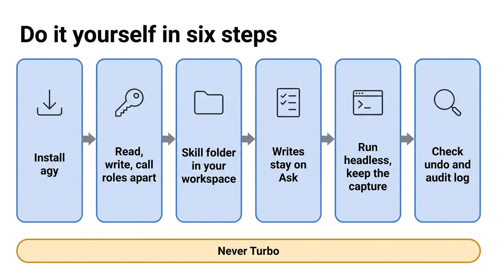

# M2 · Control the Connections — Skill Mapping

*Read this after you finish Module 2. It explains what each prompt was for, so it gives away the module's findings.*

Every number here comes from one test run on October 6, 2026 (run m2-v3; agy 1.1.19, Gemini 3.8 Flash with low thinking), except where a row in What slipped names another run: 13 prompts, 194 tool calls, about 69 minutes. The run rewrote the back office's own caller list, attached the back office to `novasmart-egress-gateway` with an access check and a registry-wide grant, and swapped its BigQuery admin role for rights to run queries and read two pricing datasets. Your run will differ.

## What you learned

<!-- FIGURE:S2_01 BEGIN -->


<!-- FIGURE:S2_01 END -->

The prompts are a leader's questions. The technique is what the skill turned them into. One thing differs from Module 1: each step has limits on what it may change. Steps 1, 2 and 4 change nothing; Steps 3 and 5 change the project, and every change still goes say, do, re-read, then a change record with its undo.

The skill adds `references/m2.md`, read whole at the first prompt, plus `m2-step1.md`, `m2-step4.md`, `m2-step5.md`, `showcase.md` and `showcase-m2.md`, each read only at its step. Each stays under about 44 KB so agy reads it in one call.

## Does the skill know the answers? Yes.

<!-- FIGURE:S2_02 BEGIN -->

![When each change may happen: five columns. Step 1, Callers: Agent Runtime IAM; one real call, changes nothing (gray card). Step 2, Cost: IAM; reports the cost, changes nothing (gray card). Step 3, Lock: Agent Runtime IAM; one caller list rewritten (green card). Step 4, Retry: Cloud Audit Logs; calls and logs, changes nothing (gray card). Step 5, Narrow: Agent Gateway + BigQuery; five changes, then the proof (green card). Each card has an open padlock. A band below reads: Is told to say only what its own re-read showed.](images/S2_02_when_each_change_may_happen.webp)

<!-- FIGURE:S2_02 END -->

`references/m2.md` describes the estate Module 2 expects, so agy knows where to look. Green marks the two steps that changed the project; gray steps changed nothing. Four rules stop it reciting:

- **Each step has limits.** A table says what each step may report and change.
- **A scope fence.** Two things may change: the back office's own caller list, and what it may reach and do. Project-wide roles (granted across everything in the project, not on one database) and the store website are findings to name and leave.
- **No DENY rule, no self-grant.** A deny would hit every agent, because agents carry no tags to scope one; agy never grants itself a role.
- **The live result wins.** The agent's own reply is never proof.

## Prompt by prompt

<!-- FIGURE:S2_03 BEGIN -->

![Six prompted steps, one skill: six blue cards: Step 1, Agent Runtime IAM; Step 2, IAM; Step 3, Agent Runtime IAM; Step 4, Cloud Audit Logs; Step 5, Agent Gateway + BigQuery; Step 7, evidence files only. A bar across all six reads SKILL.md + references/m2.md. Extra files sit under four steps: m2-step1.md under Step 1, m2-step4.md under Step 4, m2-step5.md under Step 5, showcase.md and showcase-m2.md stacked under Step 7. A second bar reads: Each step saves m2_stepN.txt. A Scorecard pill sits under Step 5.](images/S2_03_prompts_to_skill_map.webp)

<!-- FIGURE:S2_03 END -->

Step 6 · What's next has no prompt. Commands below come from the COMMANDS sections in `/config/Desktop/novasmart-evidence/m2/`, which hold every command in full (Step 5's YAML bodies and undo lines included); `<MSA_ID>` is the back office, `<PMA_ID>` the front desk. The skill also tells Step 4 to re-read `m2-step1.md`.

### Step 1 · See who can call the back office

> "Who can call our back-office margin agent right now?"

| | |
|---|---|
| Skill read | `SKILL.md`, `references/m2.md`, then `m2-step1.md` |
| What it required | Check the leftover login holds nothing else; read the agent's own list and every project role that carries the right to invoke (call an agent and make it do its job); make one real call as the leftover login; save the project policy |
| Google Cloud | Agent Runtime IAM, project IAM, Cloud Run (read) |
| Guardrail | No fix, no lock, no role named |
| May change | Nothing: a call is an action, not a change |
| Saved | `m2_step1.txt`; the call's request body and a policy snapshot in `work/` |
| agy answered | "A leftover test login just called your back-office margin agent directly and received a list of pricing tables, while fifteen separate logins and accounts hold project-wide permissions that allow calling it." |

```bash
curl -s -X POST -H "Authorization: Bearer $(gcloud auth print-access-token)" -H "Content-Type: application/json" -d '{}' https://<REGION>-aiplatform.googleapis.com/v1beta1/projects/<PROJECT>/locations/<REGION>/reasoningEngines/<MSA_ID>:getIamPolicy
gcloud projects get-iam-policy <PROJECT> --flatten="bindings[].members" --format="value(bindings.role,bindings.members)"
curl -sS -N -w '\nHTTP %{http_code}\n' -X POST -H "Authorization: Bearer $ROGUE_TOKEN" -H "Content-Type: application/json" --data-binary @/config/Desktop/novasmart-evidence/m2/work/rogue_body.json https://<REGION>-aiplatform.googleapis.com/v1beta1/projects/<PROJECT>/locations/<REGION>/reasoningEngines/<MSA_ID>/a2a/v1/message:stream
```

**Why it matters:** the HTTP 200 is the baseline Step 4 replays byte for byte. The leftover login's token is made in a throwaway `gcloud` configuration that is then deleted.

### Step 2 · See what locking it down would cost

> "Don't change anything yet. If I lock it down to just the front desk, what would break?"

| | |
|---|---|
| Skill read | No new file |
| What it required | Read again this turn; quote Step 1 by re-reading its file; caller by caller, who loses access and why; the store website's direct route as a finding |
| Google Cloud | Agent Runtime IAM, project IAM |
| Guardrail | No change, no approval request, no verdict |
| May change | Nothing |
| Saved | `m2_step2.txt` |
| agy answered | "Locking the back-office margin agent to just the front desk would break nothing that our business depends on, because the only caller that would lose access is the leftover test login." |

```bash
grep -E 'HTTP 200|novasmart_pricing' /config/Desktop/novasmart-evidence/m2/m2_step1.txt
gcloud projects get-iam-policy <PROJECT> --flatten="bindings[].members" --filter="bindings.members:<PROJECT_NUMBER>-compute" --format="table(bindings.role)"
```

**Why it matters:** the store website calls the back office directly with a login that holds project-wide roles, so the lock does not touch it. The leader judges that before anything changes.

### Step 3 · Lock it to the front desk

> "Lock the back office so only the price-match agent can call it."

| | |
|---|---|
| Skill read | No new file; the Step 3 write recipe in `references/m2.md` |
| What it required | Read the front desk's badge live; read and save the policy; change only the invoke role's members; write with the read `etag`; re-read; re-count project-wide callers; record an undo checked with `bash -n` |
| Google Cloud | Agent Runtime IAM (no `gcloud` command manages it) |
| Guardrail | Touch no other binding; never say the leftover login is out yet |
| May change | The back office's own caller list only |
| Saved | `m2_step3.txt`, one change record; the policy before and `undo_step3.sh` in `work/` |
| agy answered | "I have updated the back-office margin agent's dedicated caller list so that it names the Price Match agent's own badge, removing the leftover test login." |

```bash
curl -s -X POST -H "Authorization: Bearer $(gcloud auth print-access-token)" -H "Content-Type: application/json" -d @/config/Desktop/novasmart-evidence/m2/work/msa_policy_new.json https://<REGION>-aiplatform.googleapis.com/v1beta1/projects/<PROJECT>/locations/<REGION>/reasoningEngines/<MSA_ID>:setIamPolicy
curl -s -X POST -H "Authorization: Bearer $(gcloud auth print-access-token)" -H "Content-Type: application/json" -d '{}' https://<REGION>-aiplatform.googleapis.com/v1beta1/projects/<PROJECT>/locations/<REGION>/reasoningEngines/<MSA_ID>:getIamPolicy
```

The recorded undo reads the policy again for its new etag, then writes back the saved members.

**Why it matters:** the etag stops the write from overwriting someone else's edit. The re-count showed the same 15 project-wide callers, so the prompt's "only" is not the result.

### Step 4 · Prove the rogue caller is out

> "Try calling it as that rogue login again, and check the real escalation still works."

| | |
|---|---|
| Skill read | `m2-step4.md`, and `m2-step1.md` again |
| What it required | Wait at least 5 minutes after the write; replay Step 1's call with a fresh token; find the refusal in the audit log; one escalation through the front desk, counted only if the back office's decision comes back; checks 1-13, no scorecard |
| Google Cloud | Agent Runtime (one agent calling another), Cloud Audit Logs |
| Guardrail | "Refused" only for a 403 quoted this turn; dollar values stay in the file |
| May change | Nothing |
| Saved | `m2_step4.txt` with checks 1-13 |
| agy answered | "Calling as the leftover test login is now refused with an HTTP 403 status, and the legitimate escalation through the Price Match agent successfully reached the back office and returned an approved price override." |

```bash
gcloud logging read 'protoPayload.serviceName="aiplatform.googleapis.com" AND protoPayload.resourceName:"reasoningEngines/<MSA_ID>" AND protoPayload.status.code=7 AND timestamp>="<WRITE_TIME>"' --freshness=1h --format="table(timestamp,protoPayload.methodName,protoPayload.authenticationInfo.principalEmail,protoPayload.status.message)"
curl -sS -N -X POST -H "Authorization: Bearer $(gcloud auth print-access-token)" -H "Content-Type: application/json" "https://<REGION>-aiplatform.googleapis.com/v1/projects/<PROJECT>/locations/<REGION>/reasoningEngines/<PMA_ID>:streamQuery?alt=sse" -d '{"class_method":"stream_query","input":{"message":"A customer asks us to match BetaBuy at $296.65 for SKU-HSE-4001 (our shelf price $349.00). Approve or decline?","user_id":"m2-check"}}'
```

The replay ran 337 seconds after the write and returned `"code": 403` with `Permission 'aiplatform.reasoningEngines.query' denied`; the audit entry names `test-agent-caller`.

**Why it matters:** a refusal you caused outranks the re-read list. The escalation shows business still works, not that the list lets the front desk in: it also holds a project-wide role.

### Step 5 · Lock down what the back office can reach and do

> "Make sure the back office can only reach what it needs, and can only read the pricing data, not change it."

| | |
|---|---|
| Skill read | `m2-step5.md` |
| What it required | Changes in a fixed order, three printed checkpoints before the proof opens with `T0`; then one read and one attempted change, BigQuery's audit log, the table's last-modified time and the gateway log; records, 26 checks, scorecard |
| Google Cloud | Agent Gateway, Service Extensions, Identity-Aware Proxy, Agent Runtime, IAM, BigQuery, Cloud Audit Logs |
| Guardrail | No DENY policy; attach no other agent; no repair after the first proof call; never say the gateway stopped the change |
| May change | The attach; the access check; a registry-wide egress grant; BigQuery admin swapped for query and read rights |
| Saved | `m2_step5.txt`, five change records, 26 checks; `undo_step5.sh`; the scorecard |
| agy answered | "The back-office margin agent is now routed through the egress gateway and restricted so it can only read pricing and competitor data, and a live attempt by the agent to alter wholesale costs was refused by the database." |

<!-- FIGURE:S2_04 BEGIN -->


<!-- FIGURE:S2_04 END -->

```bash
curl -s -X PATCH -H "Authorization: Bearer $(gcloud auth print-access-token)" -H "Content-Type: application/json" -d '{"spec":{"deploymentSpec":{"agentGatewayConfig":{"agentToAnywhereConfig":{"agentGateway":"projects/<PROJECT>/locations/<REGION>/agentGateways/novasmart-egress-gateway"}}}}}' "https://<REGION>-aiplatform.googleapis.com/v1beta1/projects/<PROJECT_NUMBER>/locations/<REGION>/reasoningEngines/<MSA_ID>?updateMask=spec.deploymentSpec.agentGatewayConfig"
gcloud projects remove-iam-policy-binding <PROJECT> --member="<MSA_BADGE>" --role=roles/bigquery.admin --quiet --format="value(etag)"
gcloud logging read 'protoPayload.serviceName="bigquery.googleapis.com" AND protoPayload.authenticationInfo.principalSubject:"reasoningEngines/<MSA_ID>" AND protoPayload.status.code=7 AND protoPayload.methodName="jobservice.jobcompleted" AND timestamp>="<T0>"' --freshness=30m --limit=1 --format=json
gcloud logging read 'logName:"networkservices.googleapis.com%2Fgateway_requests" AND resource.type="networkservices.googleapis.com/Gateway" AND httpRequest.requestUrl:"bigquery" AND timestamp>="<T0>"' --freshness=1h --order=asc --format="table(timestamp,httpRequest.requestUrl,jsonPayload.agentGatewayInfo.mcpInfo.method,jsonPayload.authzPolicyInfo.result)"
```

This run's earlier `m2-step5.md` had no checkpoints; its proof still waited for the attach, over three minutes after the last IAM change.

**Why it matters:** two controls, two records: the gateway log shows its ALLOWED verdict on the BigQuery traffic; BigQuery's refusal and the unchanged table show what it may do.

#### Change records and the verify step

Each record is `Change` · `Resource` · `When` · `Undo`; undo files pass `bash -n` and are recorded, not run.

| Change | Recorded undo |
|---|---|
| Step 3: caller list names the front desk's badge | Read the policy for a fresh etag, write back the saved members |
| Access check `novasmart-iap-ext` | Delete the extension |
| Custom policy `novasmart-iap-pol` on the gateway | Delete the policy |
| `iap.egressor` for the back office's badge, registry-wide | Write back the saved bindings with a fresh etag |
| Attach to `novasmart-egress-gateway` | PATCH the field empty |
| BigQuery admin removed; job user and two dataset `READER` entries added | Admin back first, then remove the others |

Step 4 writes checks 1-13; Step 5 writes all 26 and puts one line on screen: "26 of the 26 checks are evidenced live; 0 are not verified." `scripts/update_scorecard.py` then recorded "Inbound & Outbound Perimeter Controls" as PASS. The scorecard runs only at Step 5, pass or fail, and PASS needs all 26 evidenced live.

| Checks | Cover | A failure sends you back to |
|---|---|---|
| 1-5 | The leftover login, both lists, the store website's route | Step 1 |
| 6-8 | The badge, the scoped write, the new list | Step 3 |
| 9-13 | The refusal, its audit entry, the escalation, honest scope | Step 4 |
| 14-26 | Attach, access check, data rights, proof, records, nothing else touched, no self-grant | Step 5 |

### Step 7 · Show what you controlled

> "Build me a map of who can call our back-office agent, before and after." Or any of four more Show prompts, in any order.

| | |
|---|---|
| Skill read | `showcase.md` and `showcase-m2.md`, required at each Show prompt (this run read them at the first ones only) |
| What it required | Run `scripts/show_facts.py 2 <demo>` (fact sheet plus that page's recipe) and build only from the sheet; never merge the two lists; draw project-wide holders unchanged on both sides; run `scripts/show_check.py` until clean; then run `scripts/show_record.py`, which writes the evidence entry from a log of every run, failed checks included |
| Google Cloud | None |
| Guardrail | No change; the "only the front desk can call it" sentence appears only as an overclaim a Gatekeeper player must catch |
| May change | Nothing |
| Saved | One page per prompt in `/config/Desktop/novasmart-showcase/`, such as `m2_caller_map.html`; one entry per page in `m2_step7.txt` |

**Why it matters:** every page passed the check, yet four of the five were rebuilt from the previous run's pages (see What slipped).

*Try this too:* the skill has agy answer each prompt directly, bold answer first, naming the step it builds on, never calling it optional; commands go to `m2_other.txt`; answering is in scope, acting on the answer is not.

## Who agy is, and which record to trust

<!-- FIGURE:S2_05 BEGIN -->


<!-- FIGURE:S2_05 END -->

**Two sign-ins.** agy signs in to Antigravity with a Google account or a Gemini API key. Its `gcloud`, `bq` and `curl` commands run as `antigravity-sa`, the service account (a login for a program rather than a person) on the lab workstation.

**The guardrails are instructions, not IAM.** The lab runs agy in Turbo, with every action approved automatically. By the lab's setup, `antigravity-sa` holds every write role in the table below, enough to change far more than the scope fence allows. The fence, the no-DENY rule and the self-grant ban are rules the model follows. agy said so itself in Step 5: "I placed two direct calls to the agent using my own login (`antigravity-sa`), which succeeded because my account holds a project-wide role that permits invoking agents."

**Three records.** The evidence file is written by the model. The [headless](https://antigravity.google/docs/cli/headless/) capture records every tool call. [Cloud Audit Logs](https://docs.cloud.google.com/logging/docs/audit) record configuration changes always, and data reads and changes only where Data Access logging is on (BigQuery has it on by default). The gateway's request log is a fourth source, separate from the audit logs: it records allow and deny decisions with no caller name. agy's working files are under `/config/.gemini/antigravity-cli/brain/<conversation-id>/`.

In this run the capture showed the gateway rows in `m2_step5.txt` came from a real command output. In an earlier run, five such rows were printed by no command at all.

## What slipped, and what it teaches

Each item names the test run it came from: this run (m2-v3, October 6), the earlier run (m2-v2, October 6) or the first run (m2-base, October 5).

| What slipped | Lesson |
|---|---|
| This run: Step 5's answer said the gateway log holds session setup, not tool calls. Its own output listed a `tools/call` row, allowed, under a second before BigQuery logged the read. | A sentence in the instructions can win over the data. Read the raw rows. |
| This run: four of the five Show pages were edited copies of the previous run's pages, left in the folder. One kept the old gateway list. | A page that passes its check can still be last run's work. Clear old output first. |
| This run: a Show page reworded the quoted refusal and kept the "quoted" label, after the checker flagged a product name inside it. | A word filter can push an agent to edit a quote. Drop the quote instead. |
| This run: the Step 7 entry recorded fact-sheet output that no command printed. | Invented evidence still slips in where checks are lighter. |
| Earlier run (m2-v2): Step 5 held five gateway "allowed" rows that no command printed, repeated in the answer, picture, scorecard and four pages. Answers also opened with typed "a background task has finished" notices. | The evidence file is agy's account. Check it against the capture. |
| Earlier run (m2-v2): Step 5's proof ran about 68 seconds after the last IAM change, before the attach finished. | A stated wait or "done" is a claim. Check the timestamps. |
| First run (m2-base): the Step 2 entry recorded three commands that never ran. | Required evidence can be invented outright. |
| First run (m2-base): four failed DENY imports were left out, under "11 commands, none failed". | Failures belong in the file too. |

## Use this at your company

| Situation | What you reuse | Basis |
|---|---|---|
| A sensitive agent other agents call | Name its callers on the agent itself, written from a fresh read with its etag | Grounded: Step 3, [Share an agent](https://docs.cloud.google.com/gemini-enterprise-agent-platform/govern/share-agent) |
| You tightened an agent's list but project roles are broad | List every project role that carries the call right; the agent's list cannot take them away | Grounded: Step 2, [resource hierarchy](https://docs.cloud.google.com/iam/docs/resource-hierarchy-access-control) (allow policies add up) |
| Proving a removal | Replay the exact call, quote the 403, find it in the audit log | Grounded: Step 4, [Cloud Audit Logs](https://docs.cloud.google.com/logging/docs/audit) |
| An agent that should read, not write | Swap admin for job user plus dataset read; prove it with BigQuery's refusal and an unchanged table | Grounded: Step 5, [BigQuery IAM roles](https://docs.cloud.google.com/bigquery/docs/access-control) |
| Routing agent traffic through a gateway | Choose fail-open or fail-closed on purpose: the docs' example uses `failOpen: false`, the lab `true` | Grounded: [Delegate authorization](https://docs.cloud.google.com/gemini-enterprise-agent-platform/govern/gateways/delegate-authorization) |

## Do it yourself

<!-- FIGURE:S2_06 BEGIN -->



<!-- FIGURE:S2_06 END -->

**Install** agy and the Google Cloud CLI, plus `curl`, `python3` and `bq`. The skill folder goes in `<workspace-root>/.agents/skills/<skill-name>/` ([Agent skills](https://antigravity.google/docs/skills)).

**A login with only what this module needs.** Keep three groups apart. Read roles see the setup. **Calls are not reads:** replaying a call or testing the proof needs the right to invoke, the same right Module 2 warns about, so grant it on one agent and say so. Add write roles only when you are ready to change things, in a test project first, and never grant yourself a role mid-run.

| Role | Covers |
|---|---|
| Read: `roles/iam.securityReviewer` | Project policy and the agent's caller list; most likely the registry egress policy (not proven) |
| Read: `roles/aiplatform.viewer` | Agents and their settings (not the caller list) |
| Read: `roles/run.viewer` | The store website's configuration |
| Read: `roles/networkservices.viewer`, `roles/networksecurity.viewer` | Gateways, access checks, policies |
| Read: `roles/logging.privateLogViewer` | Data Access audit logs and the gateway request log |
| Read: `roles/bigquery.metadataViewer` (on the dataset) | `bq show`, including the access list |
| Call: `roles/aiplatform.user` (on the agents you call) | The escalation and the proof calls |
| Write: `roles/aiplatform.admin` | The agent's caller list; the attach |
| Write: `roles/networkservices.admin`, `roles/networksecurity.admin` | The access check and its policy |
| Write: `roles/iap.admin` | The registry-wide egress grant |
| Write: `roles/resourcemanager.projectIamAdmin` | Project BigQuery roles |
| Write: `roles/bigquery.securityAdmin` (on the datasets) | Dataset `READER` entries |

**Permissions.** Use the Default or Request Review [preset](https://antigravity.google/docs/permissions), never Turbo. No `curl` rule is listed, so every `curl` line falls back to Ask, reads included.

```json
{
  "permissions": {
    "allow": ["command(gcloud projects get-iam-policy)", "command(gcloud logging read)",
              "command(gcloud run services describe)", "command(bq show)"],
    "ask": ["command(gcloud projects add-iam-policy-binding)", "command(gcloud projects remove-iam-policy-binding)",
            "command(gcloud beta service-extensions authz-extensions import)",
            "command(gcloud beta network-security authz-policies import)",
            "command(bq update)", "command(gcloud auth activate-service-account)"]
  }
}
```

**An independent record.** Run read-only questions headless and keep the capture; add `--continue` for follow-ups. Headless mode skips commands on Ask, so run Steps 3 and 5 interactively.

```bash
agy -p "Who can call our back-office margin agent right now?" --output-format stream-json > m2_step1.ndjson
```

**Check the log first.** Before relying on Step 4, confirm a refused call shows up in your project's audit log.

<!-- FIGURE:S2_07 BEGIN -->


<!-- FIGURE:S2_07 END -->

A starting `SKILL.md` addition, not a finished one:

```text
## Controlling who may call an agent, and what it may do
1. Read both lists first: the agent's own caller list and every project role
   that carries the call right. Say which one a change can touch.
2. Before a lock, make one real call as the caller you will remove; save it.
3. Write the agent's list from a fresh read, with its etag. Name who is in.
   Touch no other binding. Re-read it.
4. Wait, replay the saved call byte for byte, quote the 403 and its audit
   entry. Count a business call only if its decision comes back.
5. Narrow data rights to what the job needs. Prove "read, not change" with
   the platform's refusal and an unchanged table, never the agent's reply.
6. No deny rule as a shortcut. Never grant yourself anything.
```

In the lab, open `m2_step3.txt` (one change record) and `m2_step5.txt` (five records, 26 checks), and compare them with the order in `m2-step5.md`.

## Read more

- [Agent skills](https://antigravity.google/docs/skills)
- [Permissions](https://antigravity.google/docs/permissions)
- [Headless mode](https://antigravity.google/docs/cli/headless/)
- [Share an agent](https://docs.cloud.google.com/gemini-enterprise-agent-platform/govern/share-agent)
- [Agent Gateway overview](https://docs.cloud.google.com/gemini-enterprise-agent-platform/govern/gateways/agent-gateway-overview)
- [Route Agent Runtime traffic through Agent Gateway](https://docs.cloud.google.com/gemini-enterprise-agent-platform/scale/runtime/agent-gateway-runtime-deploy)
- [Monitor traffic through Agent Gateway](https://docs.cloud.google.com/gemini-enterprise-agent-platform/govern/gateways/monitor-agent-gateway)
- [BigQuery IAM roles and permissions](https://docs.cloud.google.com/bigquery/docs/access-control)
