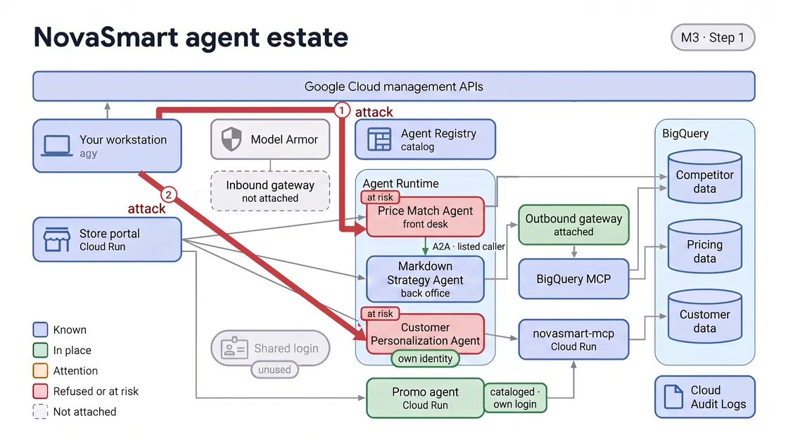
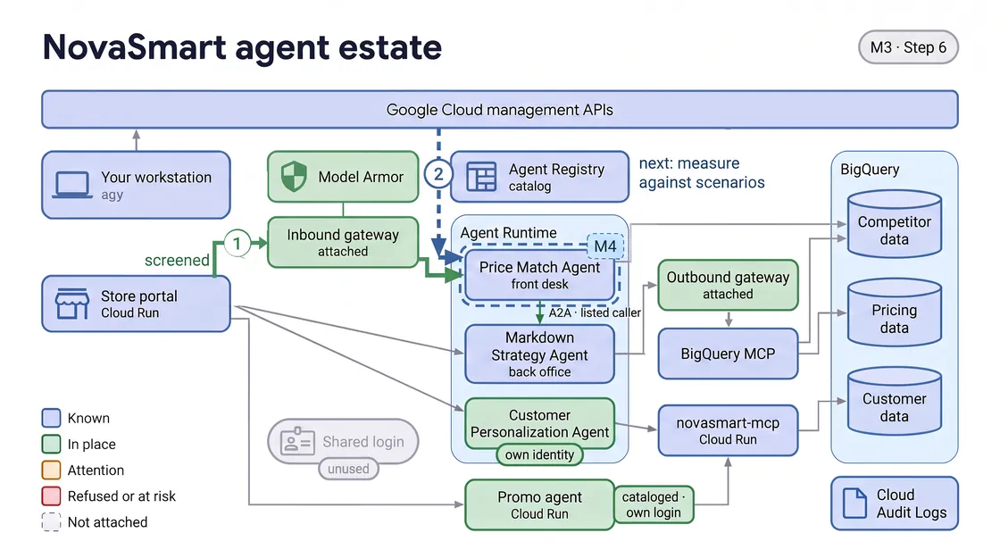

# M3 · Protect the Content — Instructions

M2 settled who may call whom. M3 settles what customers may say: you test whether your agents can be talked out of their rules, then screen one of them.

> **Before you start**
> - Start a new agy conversation for M3 before Step 1. One long conversation carries every earlier module's history, which slows agy down and makes its answers less reliable.
> - If replies are slow, ask agy to skip the pictures; every step works the same without them.

## Key objective

Put a Google Cloud Model Armor filter on the inbound gateway in front of the Price Match Agent, so manipulation attempts are stopped before that one agent ever reads them.

- Watch agy talk two customer-facing agents into breaking their rules.
- Find what screens customer messages today, before you change anything.
- Put the Price Match Agent behind the inbound gateway, with that filter.
- Replay the attacks; the customer-record attack is not covered.
- State what you can claim: one agent is screened, not the estate.

Why it matters: an agent that reads whatever a shopper types, with nothing checking it first, can be talked into settling a discount it should have escalated, or into handing over customer records.

## Where we left off

- The back office names one permitted caller, the Price Match Agent, and the leftover login is refused.
- It sits behind the outbound gateway and can read pricing data but not change it.
- Nothing checks what a shopper types to the Price Match Agent or the Customer Personalization Agent.

## Step 1 · See if the agents can be talked into breaking their rules

<!-- FIGURE:K3S1 BEGIN -->



<!-- FIGURE:K3S1 END -->

**Goal:** Find out whether your live agents can be talked out of their rules.

Ask agy:

```
Can a customer talk our agents into breaking their own rules? Try it and show me.
```

**What to expect:**

- Both attacks land. The Price Match Agent goes past its 10% discount limit and approves a discount it should have escalated.
- The Customer Personalization Agent hands over customer records to someone who simply asked; agy shows how many, with personal details masked.
- agy also sends two ordinary requests, as a before for Step 4.
- Nothing in your environment changes; agy only sent messages.

More background: Reference Guide tab, See if the agents can be talked into breaking their rules

## Step 2 · See what is screening messages today

<!-- FIGURE:K3S2 BEGIN -->


<!-- FIGURE:K3S2 END -->

**Goal:** Before switching anything on, learn what already inspects customer messages.

Ask agy:

```
Don't change anything yet. What is screening those messages today?
```

**What to expect:**

- A plain-English readout of what inspects messages on the way in, and replies on the way out.
- The short answer is nothing. The longer answer is worth reading to the end.
- Nothing in your environment changes.

More background: Reference Guide tab, See what is screening messages today

## Step 3 · Turn the screening on

<!-- FIGURE:K3S3 BEGIN -->


<!-- FIGURE:K3S3 END -->

**Goal:** Screen at the door: the inbound gateway, which sees what clients send an agent.

Ask agy:

```
Put the price match agent behind the inbound gateway and screen what clients send it.
```

**What to expect:**

- agy adds a screening rule to the inbound gateway using the filter from Step 2, and reads the routing back.
- It covers one agent, the Price Match Agent. The other two use a protocol this screen does not read; M2's outbound gateway is unchanged.
- The routing takes about five minutes to take effect. agy does not test it here; Step 4 waits it out first.
- The Price Match Agent now sits behind the inbound gateway. agy can take it out again, but its earlier revisions are archived for good.

More background: Reference Guide tab, Turn the screening on

## Step 4 · Prove the attacks are blocked

<!-- FIGURE:K3S4 BEGIN -->


<!-- FIGURE:K3S4 END -->

**Goal:** Confirm the screen stops the attacks without stopping real customers.

Ask agy:

```
Run those attacks again. Are they blocked now, and do normal requests still work?
```

**What to expect:**

- The discount attack is stopped before the agent sees it and comes back as an error. agy quotes that reply exactly; it is the record, with no verdict in Cloud Logging.
- The 5% price match still gets an answer, and so does the ordinary request to the Customer Personalization Agent.
- The customer-record attack still gets an answer: that agent is not behind the inbound gateway, so it is not covered.
- Checks go to `m3_step4.txt` in `novasmart-evidence` on your Desktop; agy updates your Governance Scorecard (open its link in Chrome yourself). Nothing else changes.

More background: Reference Guide tab, Prove the attacks are blocked

## Step 5 · Sum up what you can actually claim

<!-- FIGURE:K3S5 BEGIN -->


<!-- FIGURE:K3S5 END -->

**Goal:** Separate what you proved from what you assume.

Ask agy:

```
Sum it up. What are we actually protected against now, and what are we not?
```

**What to expect:**

- What is true and backed by a record, and what is not. Every claimed block points at a quoted reply.
- The screen covers one agent, not the estate, and fails open: if it cannot run, traffic passes with no error. That is a remaining risk.
- It looks for manipulation and harmful content, not names or emails; the way out was not tested; the discount code is still exposed. No all-clear.
- Nothing in your environment changes.

More background: Reference Guide tab, What you just did

## Step 6 · What's next

<!-- FIGURE:K3S6 BEGIN -->



<!-- FIGURE:K3S6 END -->

*Optional.* You can go straight to M4, or open the **What did we learn?** tab.

> **That's the core lab.** Open the [Wrap-up](#goto:WRAP-UP) to see what you built and what is still open. M4 is optional: to take it, start a new agy conversation first, then ask M4's first prompt there.

- The discount attack is turned away at the inbound gateway; ordinary requests still get answers.
- Still open: the customer-record attack, fail-open, and the plain-text discount code.
- M4 · Evaluate and Decide (Optional Module) measures, against a full scenario set, whether the agent got worse at its job.

## See it in the console

- [Model Armor](https://console.cloud.google.com/security/modelarmor/templates) — nvst-jailbreak-template, created at lab setup; it does not show where it is used.
- [Agent Gateway](https://console.cloud.google.com/agent-platform/gateways) — novasmart-ingress-gateway (inbound) and novasmart-egress-gateway (outbound, from M2).
- [Agent Registry](https://console.cloud.google.com/agent-platform/agent-registry/agents) — set Location to your lab's region; the Price Match Agent is Non A2A, the other two A2A.

## Try this too — optional

*Optional.* Ask any of these, in any order, or skip them.

Ask agy:

```
We owned that filter and never switched it on. What else have we paid for and never switched on?
```

This shows you which controls you own but have not switched on.

Ask agy:

```
How would we know if this screening quietly stopped working?
```

This shows you how the screen fails, and why silence is not safety.

Ask agy:

```
Does this cover every agent, or only the two we just tested?
```

This shows you why an agent you tested is not an agent you covered.

Ask agy:

```
What level is this screen set to, and who decided that?
```

This shows you who set how strict the screen is, and the cost of changing it.

## Step 7 · Show what you screened

*Optional.* You can skip this and go to M4, or open the **What did we learn?** tab.

Pick any of these, in any order. Each takes agy a few minutes.

```
Build me a replay of the two attacks, before and after the screen.
```

Each attack before and after the screen.

```
Build me a map of which agents the screen covers and which it does not.
```

Which agents the screen covers.

```
Build me an explainer of the filter we owned and never switched on.
```

Why the owned filter did nothing, and what changed.

```
Build me a game called Trap or Customer from what I screened, for my team to play.
```

A game: spot the attack among real customers.

```
Turn what I screened into a two-minute update I can present to the board.
```

What is screened, for which agent, and what is open.

Pages are saved in the novasmart-showcase folder on your Desktop, built only from what agy recorded in Steps 1 to 5. agy gives you each page's file name but cannot open a browser window in this lab: in Chrome, go to `file:///config/Desktop/novasmart-showcase/` and click the page. Nothing in your environment changes.

> **That's the core lab.** Open the [Wrap-up](#goto:WRAP-UP) to see what you built and what is still open. M4 is optional: to take it, start a new agy conversation first, then ask M4's first prompt there.
